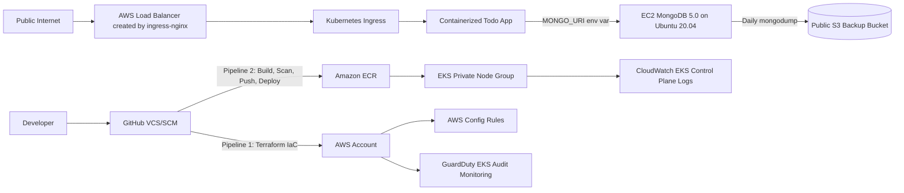

# Wiz AWS DevSecOps Lab: EKS Web App + EC2 MongoDB + Cloud Native Security

This repository builds a controlled AWS lab environment for a technical demonstration covering DevSecOps, AWS cloud architecture, Kubernetes, intentionally weak cloud configurations, and native security controls.

> Warning: this lab intentionally creates insecure resources for a hiring exercise: public SSH, public S3 backup bucket, overly permissive EC2 IAM permissions, outdated Linux/MongoDB, and Kubernetes cluster-admin assigned to the application service account. Deploy only in a dedicated lab account and destroy after the demo.

## Target architecture



## What gets deployed

| Requirement | Implementation |
|---|---|
| Two-tier web app | Node.js Express frontend/API on EKS + MongoDB on EC2 |
| Kubernetes cluster in private subnet | EKS managed node group in private subnets |
| Public web exposure | Kubernetes Ingress via ingress-nginx controller and AWS public NLB |
| MongoDB VM | EC2 public subnet, Ubuntu 20.04, MongoDB 5.0 repository |
| MongoDB auth | `appuser` and admin user created during EC2 bootstrap |
| MongoDB network restriction | Security group permits 27017 from VPC CIDR only |
| Public SSH weakness | Security group permits TCP/22 from `0.0.0.0/0` |
| Over-permissive VM IAM | EC2 role has `AmazonEC2FullAccess` and `AmazonS3FullAccess` |
| Daily DB backup | Cron runs `mongodump` and uploads to S3 |
| Public object storage weakness | S3 bucket policy allows `s3:ListBucket` and `s3:GetObject` for `Principal: *` |
| Container file requirement | `/app/wizexercise.txt` contains `Vamshidhar’s Seetha` |
| K8s admin weakness | App service account bound to `cluster-admin` |
| Cloud audit logging | EKS control plane logs: api, audit, authenticator, controllerManager, scheduler |
| Detective controls | AWS Config rules for public S3 and unrestricted SSH; GuardDuty EKS audit monitoring |
| Pipeline controls | GitHub OIDC, Checkov IaC scan, Gitleaks secret scan, Trivy filesystem/image scan, ECR scan-on-push |

## Repository structure

```text
.
├── app/                         # Node.js MongoDB-backed todo app and Dockerfile
├── bootstrap/                   # One-time Terraform for tfstate bucket, lock table, GitHub OIDC role
├── infra/                       # Main AWS Terraform IaC
├── k8s/                         # Kubernetes namespace, RBAC, deployment, service, ingress
├── scripts/                     # App deploy and validation scripts
└── .github/workflows/           # IaC pipeline, app pipeline, security scan pipeline
```

## Prerequisites

- Dedicated AWS lab account
- AWS CLI authenticated locally for the bootstrap step
- Terraform >= 1.7
- kubectl
- Docker
- GitHub repository
- SSH key pair available locally, default: `~/.ssh/id_rsa.pub`

## Deployment lifecycle

### 1. Create and push the repository

```bash
git init
git add .
git commit -m "Initial AWS DevSecOps lab"
git branch -M main
git remote add origin git@github.com:<github-owner>/<repo-name>.git
git push -u origin main
```

### 2. Bootstrap remote Terraform state and GitHub OIDC role

Run once from a workstation with temporary AWS admin credentials:

```bash
cd bootstrap
terraform init
terraform apply \
  -var="aws_region=us-east-1" \
  -var="github_owner=<github-owner>" \
  -var="github_repo=<repo-name>" \
  -var="github_branch=main"
```

Capture these outputs:

```bash
terraform output tf_state_bucket
terraform output tf_lock_table
terraform output github_actions_role_arn
```

### 3. Configure GitHub repository variables

In GitHub, go to **Settings > Secrets and variables > Actions > Variables** and create:

| Variable | Example |
|---|---|
| `AWS_REGION` | `us-east-1` |
| `AWS_ROLE_TO_ASSUME` | Output from `github_actions_role_arn` |
| `TF_STATE_BUCKET` | Output from `tf_state_bucket` |
| `TF_STATE_LOCK_TABLE` | Output from `tf_lock_table` |
| `ADMIN_CIDR` | Your public IP CIDR, for example `203.0.113.10/32`; use `0.0.0.0/0` only for a pure lab |

### 4. Deploy AWS infrastructure through GitHub Actions

Go to **Actions > infra-iac > Run workflow** and set `apply=true`.

The pipeline performs:

1. AWS authentication using GitHub OIDC
2. Terraform format and validate
3. Checkov IaC scan
4. Terraform plan
5. Terraform apply

After apply, capture Terraform outputs from the workflow log or run locally:

```bash
cd infra
terraform init \
  -backend-config="bucket=<tf_state_bucket>" \
  -backend-config="key=infra/terraform.tfstate" \
  -backend-config="region=us-east-1" \
  -backend-config="dynamodb_table=<tf_lock_table>" \
  -backend-config="encrypt=true"
terraform output
```

### 5. Add app deployment variables in GitHub

Create these additional GitHub Actions variables from Terraform outputs:

| Variable | Terraform output |
|---|---|
| `EKS_CLUSTER_NAME` | `eks_cluster_name` |
| `ECR_REPOSITORY` | `ecr_repository_name` |
| `MONGO_URI_SSM_PARAMETER` | `mongo_uri_ssm_parameter` |

### 6. Build, scan, push, and deploy the app

Go to **Actions > app-build-deploy > Run workflow**.

The pipeline performs:

1. Docker build from `app/Dockerfile`
2. Trivy container image scan
3. Push to ECR
4. Read Mongo URI from SSM SecureString
5. Create/update Kubernetes secret
6. Apply namespace, RBAC, deployment, service, and ingress
7. Validate rollout and run demo checks

## Demo commands

### Configure kubectl

```bash
aws eks update-kubeconfig --region <region> --name <eks_cluster_name>
kubectl get nodes -o wide
```

### Show app deployment

```bash
kubectl -n wiz-lab get pods -o wide
kubectl -n wiz-lab get deploy,svc,ingress
kubectl -n ingress-nginx get svc ingress-nginx-controller
```

Use the external hostname from `ingress-nginx-controller` to open the web app in a browser. Add a todo item and refresh to prove persistence.

### Prove data is in MongoDB

From the app:

```bash
curl http://<load-balancer-hostname>/api/todos
```

From MongoDB VM:

```bash
ssh ubuntu@<mongo_public_ip>
mongo appdb -u appuser -p '<password-from-ssm-or-terraform-state>' --authenticationDatabase appdb --eval 'db.todos.find().pretty()'
```

For demo simplicity, prefer proving data through `/api/todos` and the web UI rather than exposing credentials.

### Validate required file inside running container

```bash
kubectl -n wiz-lab exec deploy/wiz-todo -- cat /app/wizexercise.txt
```

Expected output:

```text
Vamshidhar’s Seetha
```

### Demonstrate Kubernetes admin privilege weakness

```bash
kubectl -n wiz-lab auth can-i '*' '*' --as=system:serviceaccount:wiz-lab:wiz-todo-sa
kubectl get clusterrolebinding wiz-todo-sa-cluster-admin -o yaml
```

### Demonstrate MongoDB network control

Public internet should not reach MongoDB on 27017, but EKS/private VPC traffic can.

```bash
nc -vz <mongo_public_ip> 27017
kubectl -n wiz-lab exec deploy/wiz-todo -- node -e "console.log(process.env.MONGO_URI.replace(/:[^:@]+@/, ':****@'))"
```

### Demonstrate public S3 backup weakness

```bash
aws s3 ls s3://<mongo_backup_bucket>/daily/
curl https://<mongo_backup_bucket>.s3.<region>.amazonaws.com/?list-type=2
```

### Demonstrate cloud-native security controls

```bash
aws eks describe-cluster --region <region> --name <eks_cluster_name> --query 'cluster.logging'
aws logs describe-log-groups --log-group-name-prefix /aws/eks/<eks_cluster_name>/cluster
aws configservice describe-compliance-by-config-rule --region <region>
aws guardduty list-detectors --region <region>
```

Expected Config findings:

- S3 backup bucket is non-compliant for public read/list.
- MongoDB security group is non-compliant for unrestricted public SSH.

## Suggested presentation flow

1. **Objective and lifecycle**: DevSecOps from GitHub to AWS to Kubernetes to security monitoring.
2. **Architecture walkthrough**: VPC, EKS private nodes, EC2 MongoDB, public S3 backup, ECR, public ingress.
3. **IaC demonstration**: Terraform modules, remote state, OIDC role, controlled deployment.
4. **Application demonstration**: Web app, add todo, prove MongoDB persistence.
5. **Container validation**: Show `/app/wizexercise.txt` in the running pod.
6. **Intentional weaknesses**: Public SSH, public S3, over-permissive IAM, outdated MongoDB/Linux, cluster-admin pod.
7. **Preventative controls**: Pipeline gates, ECR scan-on-push, MongoDB network restriction, EKS private nodes.
8. **Detective controls**: EKS audit logs, AWS Config, GuardDuty.
9. **Remediation story**: How these weaknesses would be remediated for production.
10. **Teardown**: Destroy app and infrastructure.

## Production remediation talking points

- Replace public SSH with SSM Session Manager and no inbound SSH.
- Replace EC2 MongoDB with Amazon DocumentDB or supported MongoDB version on hardened AMI.
- Remove `AmazonEC2FullAccess` and `AmazonS3FullAccess`; use least privilege.
- Block public access on all S3 buckets and use private backups with lifecycle retention.
- Use IRSA and namespace-scoped Kubernetes RBAC instead of `cluster-admin`.
- Use External Secrets or Secrets Manager CSI driver instead of direct Kubernetes secrets.
- Use AWS Load Balancer Controller with WAF, TLS, and authenticated ingress.
- Enforce policy-as-code with OPA/Gatekeeper or Kyverno.

## Teardown

Delete the Kubernetes app first, then destroy Terraform resources:

```bash
kubectl delete -f k8s/deployment.yaml --ignore-not-found=true
kubectl delete -f k8s/rbac-cluster-admin.yaml --ignore-not-found=true
kubectl delete -f k8s/namespace.yaml --ignore-not-found=true

cd infra
terraform destroy

cd ../bootstrap
terraform destroy \
  -var="aws_region=us-east-1" \
  -var="github_owner=<github-owner>" \
  -var="github_repo=<repo-name>" \
  -var="github_branch=main"
```
